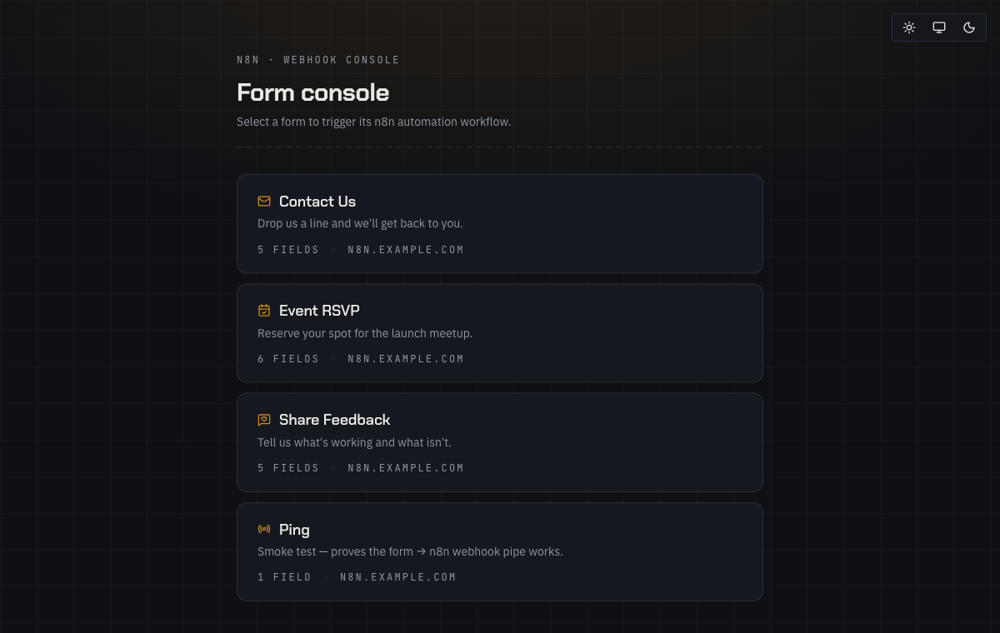
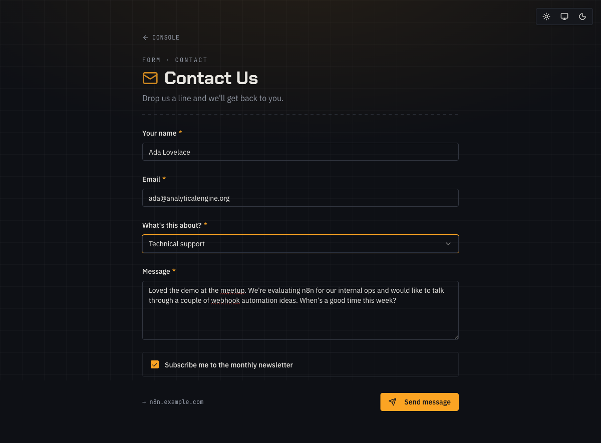
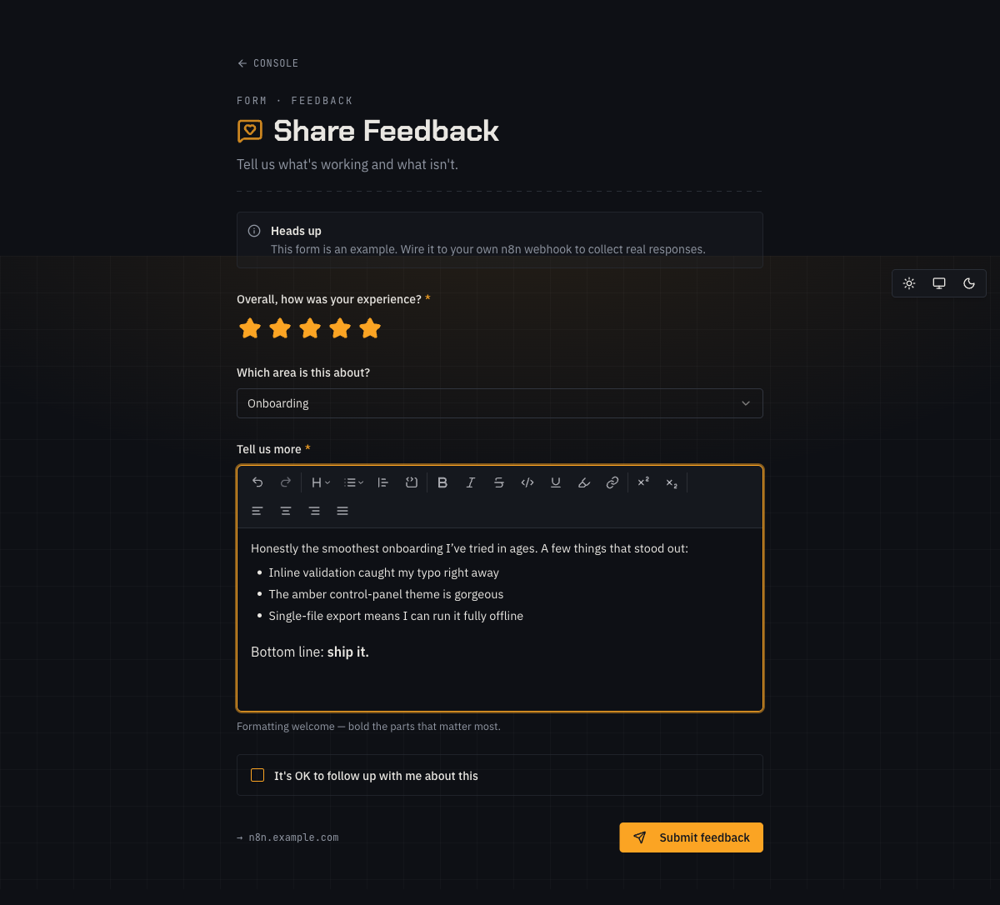

# n8n-forms

[](https://github.com/rad-orlowski/n8n-forms/actions/workflows/ci.yml)
[](LICENSE)
[](https://bun.sh)

A React form console backed by a **Hono/Bun BFF server**. Forms submit to the
BFF, which holds webhook secrets server-side and proxies traffic to
[n8n](https://n8n.io). Supports multi-page (wizard) forms, async results via
SSE, and dynamic field values fed back from n8n at runtime.



---

## How it works

1. Each form is defined as a TypeScript file (`forms/<slug>.form.ts`) using
   `pages: PageDef[]`.
2. `bun run build` produces the SPA in `dist/`; `bun start` serves it via
   the BFF.
3. The browser submits answers to the BFF (`/api/forms/:slug/start`, then
   `/api/sessions/:id/step` for each subsequent page). The BFF holds webhook
   URLs and form tokens — they are never sent to the browser.
4. n8n receives the proxied request and can return data synchronously or
   asynchronously (202 + SSE callback). Multi-page forms resume the n8n
   execution via the Wait-node `resumeUrl` stored server-side.

> **Secrets stay on the server.** Webhook URLs and form tokens live in `.env`
> — they are read by the Bun process at runtime, not baked into the JS bundle.
> Keep `.env` out of git (it is gitignored).

## Screenshots

| Filling out a form | Rich-text field |
| --- | --- |
| [](docs/images/contact.png) | [](docs/images/feedback.png) |

> The forms above ship as runnable examples in
> [`forms/examples/`](forms/examples) — copy one as a starting point for your
> own. To hide every example from the console without deleting them, set
> `SHOW_EXAMPLE_FORMS=false` in `.env` (default is `true`).

---

> **WARNING: `.env` contains your secrets.** Webhook URLs and form tokens are
> read by the server at runtime — never commit `.env`, never share it, and
> treat it like a private key. If compromised, rotate the webhook URLs in n8n
> and update `.env`.

---

## Quick start

### Prerequisites

- [Bun](https://bun.sh) — **required**. This project does not support npm,
  yarn, or pnpm. Use `bun` for every command shown below.
- A running n8n instance with at least one Webhook node (see
  [n8n docs](https://docs.n8n.io/integrations/builtin/core-nodes/n8n-nodes-base.webhook/))

### Setup

```bash
cp .env.example .env          # fill in webhook URLs + form tokens
bun install
```

### Local development

```bash
bun dev
```

One terminal. Starts the BFF (Hono/Bun) with Vite in middleware mode — HMR
works, `/api/*` routes are live, everything on a single port.

Navigate to `http://localhost:3737/#/<slug>?t=<FORM_TOKEN_SLUG>`.

### Production

```bash
bun run build        # compiles TypeScript + bundles SPA → dist/
bun start            # serves dist/ + /api/* on PORT (default 3000)
```

Or with Docker:

```bash
docker compose up    # builds the image and starts the server
```

---

## Project structure

```text
.
├── forms/                  # one *.form.ts per form (auto-discovered, recursively)
│   └── examples/           # runnable example forms (contact, feedback, event-rsvp)
├── src/
│   ├── server/             # Hono BFF server
│   │   ├── index.ts        # entry point — serves dist/ + /api/*
│   │   ├── config.ts       # env loading (WEBHOOK_*, FORM_TOKEN_*, PORT)
│   │   ├── auth.ts         # constant-time token validation
│   │   ├── db.ts           # bun:sqlite session store
│   │   ├── n8n.ts          # n8n proxy helper (sync + 202/SSE)
│   │   ├── events.ts       # in-process SSE subscriber registry
│   │   └── routes/         # forms.ts, sessions.ts, callback.ts
│   ├── components/
│   │   ├── FormShell.tsx   # wizard: multi-page RHF + zod + SSE + response
│   │   ├── fields/         # field components + FIELD_REGISTRY
│   │   ├── tiptap-*/       # vendored TipTap simple editor (rich-text field)
│   │   └── ui/             # shadcn/ui primitives
│   ├── lib/
│   │   ├── schema.ts       # PageDef, FormSchema, defineForm(), buildZodSchema()
│   │   └── submit.ts       # startForm() / stepForm() / openEventStream() via BFF
│   └── index.css           # "industrial control panel" dark theme (charcoal/amber)
├── Dockerfile              # multi-stage oven/bun build + runtime
├── docker-compose.yml      # one service, env_file: .env, restart: unless-stopped
├── .env.example            # WEBHOOK_*, FORM_TOKEN_*, PORT template
└── docs/
    └── n8n-contract.md     # n8n workflow contract for integrators
```

---

## Adding a form

The app auto-discovers every `*.form.ts` under the `forms/` directory (including
subfolders like `forms/examples/`) via `import.meta.glob` — no manual registration
is needed. Just create the file, add the env keys, and restart the dev server.

1. **Create** `forms/<slug>.form.ts`:

   ```ts
   import { defineForm } from "@/lib/schema";

   export default defineForm({
     slug: "my-form",
     title: "My Form",
     submitLabel: "Send",
     timeoutMs: 30000,                           // sync-reply wait (ms); "indefinite" = no timeout; per-page override available
     response: { header: { message: "Done!" } }, // success line (optional)
     pages: [
       {
         fields: [
           { type: "text",     name: "name",  label: "Your name", required: true },
           { type: "email",    name: "email", label: "Email",     required: true },
           { type: "textarea", name: "body",  label: "Message" },
         ],
       },
     ],
   });
   ```

2. **Add the env keys** to `.env` and `.env.example`:

   ```env
   WEBHOOK_MY_FORM=https://YOUR-N8N-HOST/webhook/my-form
   FORM_TOKEN_MY_FORM=change-me
   ```

The full form schema is the source of truth in
[`src/lib/schema.ts`](src/lib/schema.ts). See
[`forms/examples/ping.form.ts`](forms/examples/ping.form.ts) for a minimal
working example, [`forms/examples/wizard-demo.form.ts`](forms/examples/wizard-demo.form.ts)
for multi-page + dynamic fields, or [`forms/examples/`](forms/examples) for
fuller single-page forms.

> **Examples vs. your own forms.** Any form under `forms/examples/` is treated
> as an example and is hidden from the console when `SHOW_EXAMPLE_FORMS=false`.
> Keep your own forms at the top level of `forms/` so they always show. The SPA
> reads this flag at load time from `GET /api/config` (no secrets in that
> response).

### Rendering the workflow response

Add a `response` key to display fields from n8n's JSON reply in the success panel:

```ts
response: {
  header: { title: "Result" },          // accent title above the fields
  fields: [
    { key: "title", format: "heading" },              // large amber title
    { key: "summary", prose: true },                  // long text → readable sans
    { key: "role", label: "Role", section: "Details" }, // groups into a panel
    { key: "tech_stack", format: "tags" },            // array → Badge chips
    { key: "key_requirements", format: "list" },      // array → checklist
  ],
},
```

Keys are dot-paths resolved via `es-toolkit/compat` `get`. The reply may be
a bare object `{...}` or array-wrapped `[{...}]` — both are handled. A
legacy `0.` prefix is still tolerated.

The success header is configured via `response.header` (`style`: `compact`
(default) / `full` / `none`; `heading`, `message`, `title`). The success
line lives at `response.header.message` (there is no top-level
`successMessage`). Per-field: `format` is `heading` / `tags` / `list`,
`prose: true` renders sans body text, `section` groups fields into a
bordered panel, and `hideIfEmpty` omits empty rows. Full reference:
[`forms/CLAUDE.md`](forms/CLAUDE.md).

---

## Available forms

<!-- docs FORMS_LIST -->
| Slug | Title | Source |
| --- | --- | --- |
| `contact` | Contact Us | [`forms/examples/contact.form.ts`](forms/examples/contact.form.ts) |
| `event-rsvp` | Event RSVP | [`forms/examples/event-rsvp.form.ts`](forms/examples/event-rsvp.form.ts) |
| `feedback` | Share Feedback | [`forms/examples/feedback.form.ts`](forms/examples/feedback.form.ts) |
| `ping` | Ping | [`forms/examples/ping.form.ts`](forms/examples/ping.form.ts) |
| `wizard-demo` | Wizard Demo | [`forms/examples/wizard-demo.form.ts`](forms/examples/wizard-demo.form.ts) |
<!-- /docs -->

---

## Available field types

<!-- docs FIELD_TYPES -->
| `type` | Kind | Notes |
| --- | --- | --- |
| `text` | input | |
| `email` | input | |
| `url` | input | |
| `textarea` | input | |
| `number` | input | supports `min` / `max` |
| `select` | input | requires `options: [{label, value}]` |
| `checkbox` | input | sends boolean |
| `date` | input | sends ISO date string |
| `rating` | input | `max` defaults to 5, sends number |
| `richtext` | input | TipTap editor — sends HTML; debounced ~250 ms, flushes on blur |
| `heading` | static | display only — no payload value |
| `description` | static | display only — no payload value |
| `image` | static | display only — no payload value |
| `alert` | static | display only — no payload value |
<!-- /docs -->

> **Rich-text field — HTML output:** The `richtext` field submits TipTap's
> HTML to the webhook. The form renders response data as plain text only (no
> `dangerouslySetInnerHTML`), so the app itself is safe. However, the
> receiving n8n workflow is responsible for sanitizing this HTML before
> storing it in a database or rendering it in any other web context.

To add a custom field type: build a component accepting `{ field, def }: FieldComponentProps`,
then register it in `FIELD_REGISTRY` in [`src/components/fields/index.ts`](src/components/fields/index.ts).
Use the new `type` string in any `*.form.ts`.

---

## n8n CORS requirement

The BFF calls n8n server-to-server — CORS only matters for direct-browser
access to n8n, which this app does not do. You can (and should) restrict
n8n's `Allowed Origins` to the BFF's host in production rather than `*`.

### Idempotency and POST retry

The BFF intentionally does not retry failed n8n calls (see
`src/server/n8n.ts`). This avoids double-triggering workflows when a
submission is ambiguous. If your workflow must be idempotent (e.g., it
inserts a unique record), implement server-side deduplication in n8n — for
example, by storing the `sessionId` and checking it before processing.

See [`docs/n8n-contract.md`](docs/n8n-contract.md) for the full workflow
integration guide.

---

## Commands

<!-- docs PACKAGE_SCRIPTS -->
| Command | Description |
| --- | --- |
| `bun run build` | Compile TypeScript + bundle SPA → `dist/` |
| `bun run dev` | Single dev server: Hono BFF + Vite middleware at `http://localhost:3737` (HMR included) |
| `bun run dev:vite` | Vite standalone at `http://localhost:5173` (SPA only, no BFF) |
| `bun run docs:generate` | Regenerate autogenerated sections in all markdown files |
| `bun run lint` | Run ESLint across all source files |
| `bun run preview` | Preview the Vite production build locally |
| `bun run schema:generate` | `bun scripts/generate-form-schema.ts` |
| `bun run start` | Serve `dist/` + `/api/*` via the Hono BFF (production) |
| `bun run test` | Run the full suite: Vitest (UI + pure lib) then `bun test` (Bun-runtime server files) |
| `bun run test:coverage` | Run both suites with coverage + thresholds (Vitest V8, then `bun test`) |
| `bun run test:server` | Run only the Bun-runtime server specs (`*.bun.test.ts`) via `bun test` |
| `bun run test:watch` | Run Vitest in watch mode |
<!-- /docs -->

Or with Docker: `docker compose up`

---

## Tech stack

- **Hono** on **Bun** — BFF server (static serving, `/api/*` routes, SSE)
- **bun:sqlite** — session store (resumeUrl, last callback payload, TTL GC)
- **React 19** + **TypeScript** + **Vite** — SPA
- **React Hook Form** + **Zod** — per-page form state and validation
- **shadcn/ui** + **Tailwind CSS** — UI primitives
- **TipTap** (vendored simple editor) — rich-text field
- **ky** — HTTP client for BFF → n8n proxy calls
- **es-toolkit** — `debounce` (TipTap field) + `get` (dot-path resolution)
- **Bun** — package manager, runtime, and test runner
